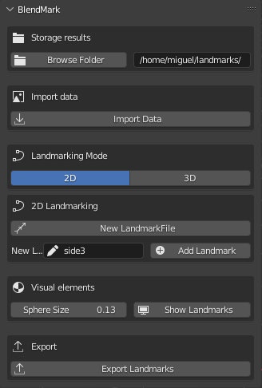

# BlendMark

This addon allows you to create landmarks for Geometric Morphometrics analysis in Blender. Currently is possible to create landmarks for 2D and 3D.

The output files are CSV with 4 columns (landmark name, X, Y and Z coords)

## Installation

Download the repo, zip the file and install it on Blender

## Usage

- Select the storage path for the landmarks using the Browse folder button
- Import the file you want to use as a reference. It could be a 3D model or an image
- Select the type of landmarks you want to create (2D or 3D)

### 2D Landmarks
- Select your image in the scene
- Click on 'New lamdmark file' to create a new empty mesh and collection where the landmarks will be stored. This action also will change the mode to Edit mode and the 3D cursor tool will be activated
- Click on any point of the image to select the position of the landmark.
- Input a name for the landmark
- Click on 'Add landmark' to store the landmark
- Repeat the process until you have all the landmarks you need

Note: Landamarks automatically will be shown as spheres according to the value in Sphere size. For now, this size can only be defined at the beginning of the process. To change the size of the spheres you need to delete the geometry node modifier of the object or change the value in the geometry nodes editor.

### 3D Landmarks

- Select your 3D model in the scene
- Click on start landmarking, this will change the mode to Edit mode and the selection tool will be activated
- Select the vertex you want to use as a landmark
- Input a name for the landmark
- Click on 'Add landmark' to store the landmark. The landmark will be stored as a vertex group. In case of mistakes, you can delete the vertex group and repeat the process.
- Repeat the process until you have all the landmarks you need
- Press "Generate 3D landmarks" to extract the landmarks from the model and store them in a new object in the "Landmarks" collection. If the collection does not exist, it will be created and if the object already exists, it will be deleted and replaced by the new one.
- In the same way as the 2D landmarks, the spheres will be shown according to the value in Sphere size. To change the size of the spheres you need to delete the geometry node modifier of the object or change the value in the geometry nodes editor.

## Export the landmarks

- Click on 'Export landmarks' to save the landmarks in a CSV file. The file will be saved in the path you selected at the beginning of the process.
- The csv file contains 4 columns: landmark name, X, Y and Z coords
- The coords are obtained from the vertex groups in the Landmarks collection, for this reason, be sure:

    - not to delete the vertex groups before exporting the landmarks
    - not to modify the vertex groups before exporting the landmarks
    - not to modify the object before exporting the landmarks
    - not change the name of the collection before exporting the landmarks
- The 2D landmarks include also the Z coords, you need to remove this column if you are working with 2D landmarks.

