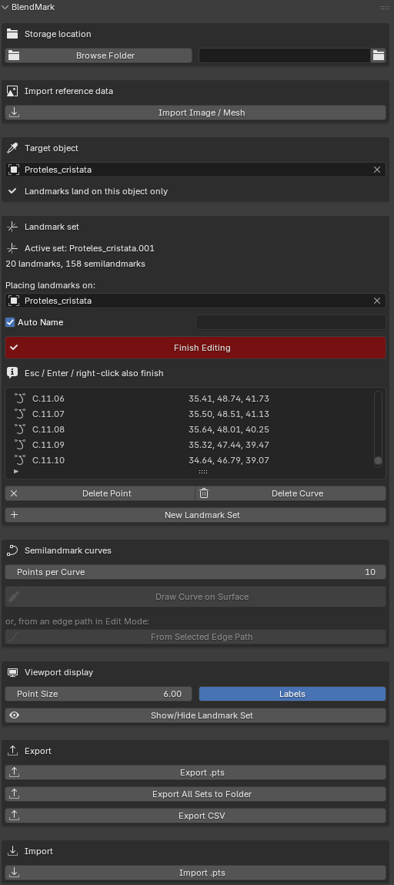
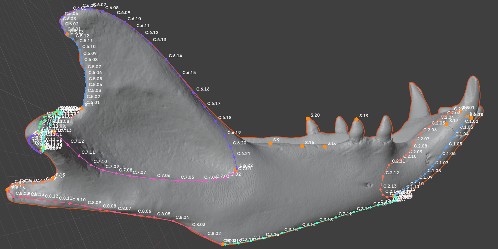

# BlendMark

[](https://www.blender.org/)
[](https://www.blender.org/)
[](https://github.com/MiguelDLM/BlendMark/releases)
[](https://github.com/MiguelDLM/BlendMark/releases)
[](https://github.com/MiguelDLM/BlendMark/releases)
[](https://www.gnu.org/licenses/old-licenses/gpl-2.0.html)

This addon lets you digitize landmarks and curve semilandmarks for Geometric Morphometrics analysis in Blender, on 3D meshes or 2D reference images.



Landmarks are **not** stored as mesh geometry. They are plain points (name + X, Y, Z) kept on a lightweight "landmark set" object and drawn as a viewport overlay, so digitizing never touches the specimen mesh.

## Installation

1. Go to [Releases](https://github.com/MiguelDLM/BlendMark/releases) and download the latest `blendmark.zip`.
2. In Blender (**4.2+ / 5.1.2**):
   - Open **Edit > Preferences > Get Extensions** (or **Add-ons**).
   - Click the top-right menu (⌵) and select **Install from Disk...**.
   - Choose the downloaded `blendmark.zip`.
   - Ensure the extension is enabled.

## Workflow

1. **Storage location**: pick the folder exported files will be saved to (Browse Folder).
2. **Import reference data**: import the 3D model (obj/stl/ply) or reference image (jpg/png/...) you want to digitize.
3. **Target object**: choose the object to digitize from the dropdown, or grab it with the eyedropper. Landmarks can *only* be placed on this object's surface — clicks that miss it are ignored, so you can never leave a point floating in mid-air. The field is pre-filled automatically after an import.
4. **New Landmark Set**: click "New Landmark Set". This creates an empty object (in the "Landmarks" collection) that will hold the points — no geometry is added to your specimen. Each set remembers its own target object, shown (and changeable) in the panel.
5. **Edit Landmarks**: with the landmark set active, click "Edit Landmarks" to enter the picking tool:
   - Left-click on the target object to add a landmark (ray-cast onto the mesh surface, or onto the reference image).
   - Left-click and drag an existing marker to move it.
   - Hover a marker and press `X` to delete it.
   - Finish with the **Finish Editing** button in the panel, or `Esc`, `Enter` or right-click in the viewport. While the tool runs, a banner in the viewport reminds you it is active and how to leave it.
   - Clicks outside the 3D viewport (sidebar, menus, header) work normally and never create landmarks.
   - New landmarks are auto-named `S.1`, `S.2`, ... unless "Auto Name" is turned off, in which case the "New Landmark" field is used.
6. **Semilandmark curves**: set "Points per Curve", then create curves either way — both produce points named `C.<curve>.<index>` (e.g. `C.1.01`, `C.1.02`, ...):
   - **Draw Curve on Surface** (recommended): drag across the object to draw a freehand stroke. The stroke is ray-cast onto the surface as you go, shown live, and on release it is resampled into equally-spaced semilandmarks. Keep drawing for more curves; finish like the editing tool.
   - **From Selected Edge Path**: when you need the curve to follow the real mesh topology, select a connected edge path in Edit Mode (Edge Loop / Shortest Path select) and click this instead.
7. **Viewport display**: adjust marker size and toggle name labels under "Viewport display". "Show/Hide Landmark Set" toggles the overlay for the active set.


## Export

- **Export .pts**: writes the active landmark set to the [.pts format](#pts-format) used by tools like Viewbox/Checkpoint.
- **Export All Sets to Folder**: writes every landmark set in the scene to `<selected folder>/<set name>.pts`.
- **Export CSV**: writes the active landmark set to a CSV with columns `Landmark, X, Y, Z`.

## Import

- **Import .pts**: loads a `.pts` file as a new, editable landmark set overlay (no mesh is created). Use "Edit Landmarks" afterwards to correct or add points.

## .pts format

```
Version 1.0
164
S.1 -1.006544e+02 -5.822028e+00 3.054618e+02
...
C.1.01 -1.011823e+02 -5.624844e+00 3.031564e+02
C.1.02 -1.010203e+02 -4.323217e+00 3.000281e+02
...
```

- Line 1: version header.
- Line 2: point count (informational, recomputed on import).
- `S.<n>`: landmark `n`.
- `C.<curve>.<index>`: semilandmark `index` of curve `curve`.
